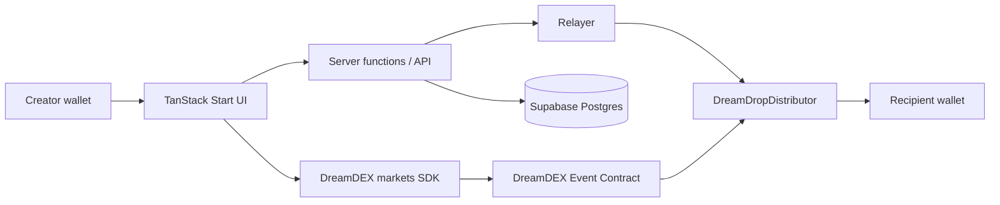

# DreamDrop architecture

DreamDrop is a distribution layer for DreamDEX Event Contract outcome tokens. It does not create or resolve markets.

Mock mode is an intentional, isolated demo. Live mode uses injected wallet state, Shannon chain state, server persistence, and real receipts; it must never synthesize successful hashes or balances.

The database is not authoritative for blockchain facts. Writes revalidate market state, and confirmed actions reconcile transaction receipts and outcome-token balances before application state advances.
